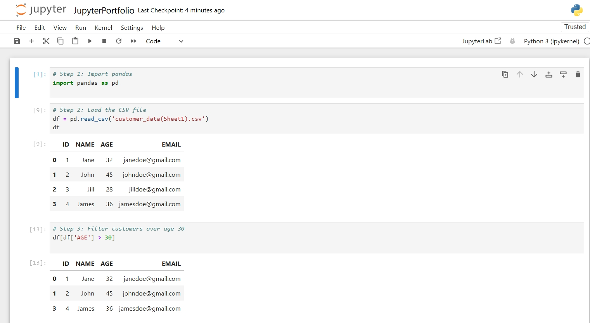
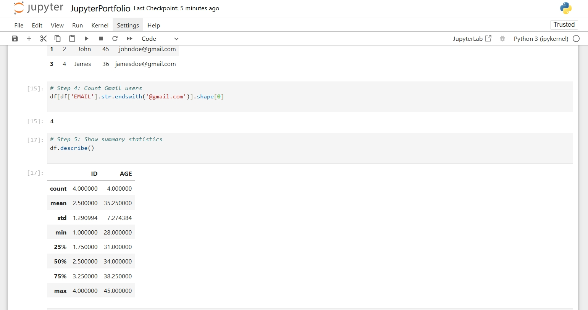

# Jupyter-customer-data
## Customer Insights Analysis Project

This project analyzes customer data from a sample CSV file using Python (Pandas, Matplotlib). It explores key business questions like:

- Which customer are the target audience according to age?
- How many customers are gmail users?
- What does the summary statistics look like?

## 📁 Files Included

- `customer_data(Sheet1).csv`: Sample customer dataset
- `Jupyterportfolio.ipynb`: Jupyter notebook with all analysis
- `/images`: Visualizations used in the notebook

## 🛠 Skills Used

- Python (Pandas, Matplotlib)
- Data cleaning & transformation
- Exploratory Data Analysis (EDA)
- Data visualization

## 📊 Sample Visualizations

  

---

**Last updated**: July 2025
